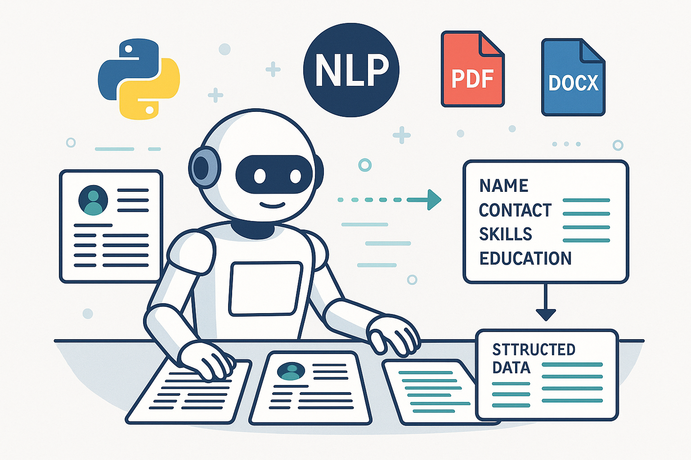

# Resume Parser



A modern, LLM/VLM-powered resume parser with a Streamlit web interface. Upload PDF resumes and extract structured candidate information using state-of-the-art language and vision models.

## Features

- **PDF Resume Upload:** Upload resumes in PDF format.
- **Image & Text Extraction:** Converts PDFs to images, extracts text using a Vision-Language Model (VLM).
- **Structured Field Extraction:** Uses a Language Model (LLM) to extract fields like name, profession, experience, etc.
- **Editable Output:** Review and edit extracted fields in the web UI.
- **Configurable Models:** Easily switch between different LLM/VLM models and API endpoints.
- **Docker Support:** Run the app in a containerized environment.
- **Powered by [dspy](https://github.com/stanford-oval/dspy):** Uses dspy for LLM/VLM orchestration under the hood.

## Recommended: Use [uv](https://github.com/astral-sh/uv) as Python Package Manager

`uv` is a fast, modern Python package manager. It is recommended for installing dependencies and running the project.

## Quickstart

### 1. Clone the Repository

```bash
git clone 
cd resume-parser
```

### 2. Set Up Environment Variables

Copy and edit the example environment file:

```bash
cp example.env .env
# Edit .env to add your API keys and endpoints
```

### 3. Install Dependencies

#### With Docker (Recommended)

Build and run the app:

```bash
docker build -t resume-parser .
docker run -p 8501:8501 --env-file .env resume-parser
```

#### Locally (with uv)

First, install [uv](https://github.com/astral-sh/uv):

```bash
pip install uv  # or see uv docs for other install methods
```

Then, install dependencies and run the app:

```bash
uv pip install -e .
streamlit run ui.py
```

#### Locally (with pip, not recommended)

```bash
pip install -e .
streamlit run ui.py
```

### 4. Open the App

Visit [http://localhost:8501](http://localhost:8501) in your browser.

## Configuration

Edit `.env` to set your model names, API keys, and endpoints:

```env
VLM_MODEL=your-vlm-model
VLM_API_KEY=your-vlm-api-key
VLM_API_BASE=http://localhost:8001

LLM_MODEL=your-llm-model
LLM_API_KEY=your-llm-api-key
LLM_API_BASE=http://localhost:8001

PROMTPING_MODE=naive
TEMPERATURE=0.7
```
> **Prompting Modes:**  
> The `PROMTPING_MODE` setting supports the following modes, as provided by [dspy](https://github.com/stanford-oval/dspy):
> - `naive`: Simple, single-pass prompting.
> - `cot`: Chain-of-Thought prompting for step-by-step reasoning.
> - `refine`: Iterative refinement prompting.
>  
> Set `PROMTPING_MODE` in your `.env` file to one of these values to control how the model generates outputs.

You can also adjust these settings in the Streamlit sidebar.

## Project Structure

```
resume-parser/
  ├── src/resumeparser/      # Core parsing logic
  ├── ui.py                  # Streamlit web UI
  ├── example.env            # Example environment variables
  ├── Dockerfile             # Docker setup
  ├── tests/                 # Test scripts
  └── README.md
```

## Development

- Core logic in `src/resumeparser/`
- Web UI in `ui.py`
- Tests in `tests/`
- Uses [dspy](https://github.com/stanford-oval/dspy) for LLM/VLM orchestration

## License

[MIT](LICENSE) (or your license here)

## Running with Docker Compose

You can easily deploy the app using Docker Compose. The provided `docker-compose.yaml` will build the image from the included `Dockerfile` and start the service.

```sh
# Build and run the app
docker-compose up --build
```

- The app will be available at [http://localhost:8501](http://localhost:8501).
- Environment variables are loaded from the `.env` file (copied from `example.env`).
- To enable live code updates during development, uncomment the `volumes` section in `docker-compose.yaml`.
